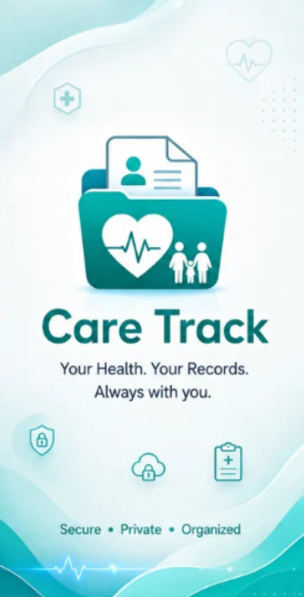
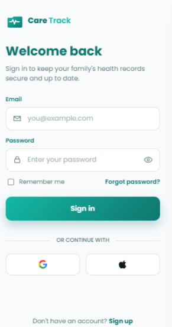
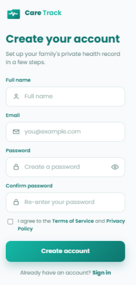
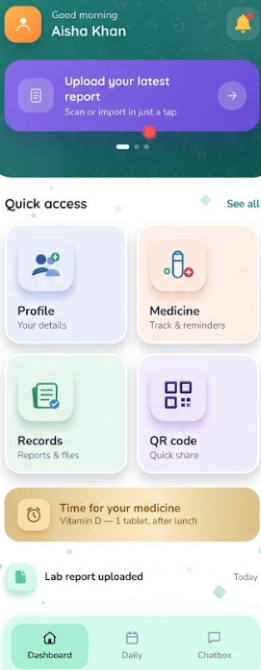
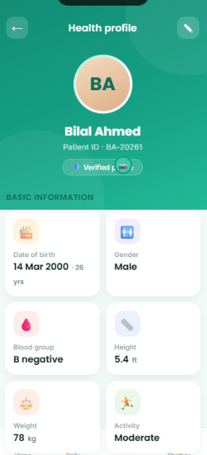
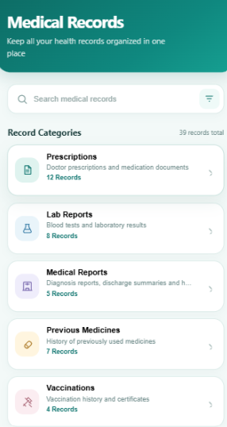
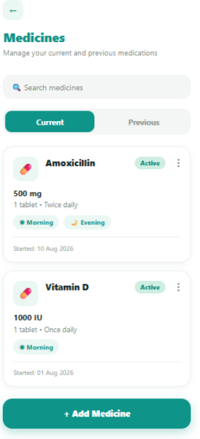
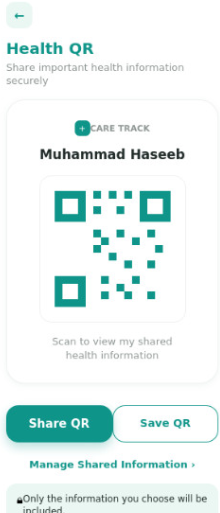

# 🩺 Care Track

**Care Track** is a Flutter-based digital health record management application designed to help users organize, access, and manage their important healthcare information in one convenient place.

The application provides an easy-to-use interface for managing medical records, medicines, personal health information, and other healthcare-related data while using Firebase services for authentication and cloud-based data management.

---

## 📱 About the Project

Managing health information can become difficult when prescriptions, laboratory reports, medicine details, and previous medical records are stored in different places.

**Care Track** provides a centralized digital platform where users can maintain their important health information and access it whenever needed.

The application focuses on simplicity, organization, accessibility, and a user-friendly healthcare experience.

---

## 🎯 Problem Care Track Solves

Traditional healthcare information is often scattered between:

* Paper prescriptions
* Laboratory reports
* Medicine records
* Hospital documents
* Personal health information
* Previous treatment records

This can make it difficult for patients to quickly find important information when visiting a doctor or during an emergency.

**Care Track solves this problem by providing one digital location for maintaining and accessing personal healthcare information.**

---

## ✨ Main Features

### 🔐 User Authentication

Users can securely create an account and log in to their personal Care Track profile.

### 🏠 Health Dashboard

A clean dashboard provides quick access to the major features of the application.

### 📁 Medical Records

Users can organize important medical information such as:

* Prescriptions
* Medical reports
* Laboratory records
* Previous medicines
* Other healthcare documents

### 💊 Medicine Management

Users can maintain information related to their medicines in an organized digital format.

### 👤 Personal Profile

Users can manage their personal and basic healthcare information from the profile section.

### 📱 QR Health Sharing

Care Track provides a QR-based sharing feature designed to make important health information easier to access and share when required.

### 🩺 Care Guide

The Care Guide provides a more interactive health experience by allowing users to enter health-related information, analyze it, and receive useful recommendations.

### 📊 Health Information Visualization

Health information can be presented in a clear and understandable way to help users better understand their records.

### 🔔 User-Friendly Navigation

The application uses simple navigation and clearly organized sections so important features can be accessed quickly.

---

## ⚙️ How the System Works

The general workflow of Care Track is:

```text
User Opens App
       ↓
Splash Screen
       ↓
Login / Registration
       ↓
Firebase Authentication
       ↓
Care Track Dashboard
       ↓
User Selects a Feature
       ↓
Records / Medicines / Profile / QR / Care Guide
       ↓
Data Managed Through Firebase
```

After authentication, the user enters the main Care Track dashboard. From there, different application modules can be accessed while the user's information is managed through the application's Flutter and Firebase architecture.

---

## 🛠️ Technologies Used

| Technology                  | Purpose                                         |
| --------------------------- | ----------------------------------------------- |
| **Flutter**                 | Cross-platform application development          |
| **Dart**                    | Main programming language                       |
| **Firebase**                | Backend cloud services                          |
| **Firebase Authentication** | User signup and login                           |
| **Cloud Firestore**         | Cloud-based application data management         |
| **Android Studio**          | Development and Android testing                 |
| **Git & GitHub**            | Version control and project hosting             |
| **Material Design**         | User-interface components and design principles |

---

## 🏗️ Project Architecture

Care Track follows an organized Flutter project structure with centralized and reusable application components.

The project includes:

* Centralized application colors
* Centralized themes
* Centralized text styles
* Application routes
* Reusable widgets
* Asset management
* Feature-based screens
* Firebase services
* Authentication handling

This structure makes the application easier to maintain, understand, and extend.

---

## 📸 Application Screenshots

### Splash Screen



### Authentication

| Login                                         | Registration                                          |
| --------------------------------------------- | ----------------------------------------------------- |
|  |  |

### Main Application

| Dashboard                                   | Profile                                           |
| ------------------------------------------- | ------------------------------------------------- |
|  |  |

### Healthcare Features

| Medical Records                                   | Medicines                                           |
| ------------------------------------------------- | --------------------------------------------------- |
|  |  |

### QR Health Sharing



### Care Guide


---

## 📂 Project Structure

```text
lib/
│
├── core/
│   ├── constants/
│   ├── routes/
│   ├── theme/
│   └── widgets/
│
├── features/
│   ├── authentication/
│   ├── home/
│   ├── profile/
│   ├── records/
│   ├── medicines/
│   ├── qr/
│   └── care_guide/
│
├── services/
│
└── main.dart
```

> The exact internal folder structure may vary as the application continues to evolve.

---

## 🚀 Getting Started

### Prerequisites

Make sure the following tools are installed:

* Flutter SDK
* Dart SDK
* Android Studio or Visual Studio Code
* Android Emulator or physical Android device
* Git

### Clone the Repository

```bash
https://github.com/maimoona8021-bit/care-track.git
```

Move into the project directory:

```bash
cd care-track
```

Install Flutter dependencies:

```bash
flutter pub get
```

Check the Flutter environment:

```bash
flutter doctor
```

Run the application:

```bash
flutter run
```

---

## 🔥 Firebase Integration

Care Track uses Firebase for application backend functionality, including:

* User authentication
* User-related data management
* Cloud database integration

A valid Firebase configuration is required when running a separate clone of the project.

---

## 🔒 Privacy & Security

Care Track is designed as a healthcare record management project. Authentication and cloud-based data management help separate individual user information.

For a production healthcare system, additional security, privacy, regulatory compliance, encryption, access-control, and backend validation measures would be required.

---

## 🌟 Advantages of Care Track

* Centralized healthcare information
* Easy access to medical records
* Organized medicine information
* Simple and modern interface
* Secure account-based access
* QR-based health information sharing
* Digital alternative to scattered paper records
* Scalable Flutter and Firebase architecture

---

## 🔮 Future Improvements

Future versions of Care Track can include:

* Doctor and hospital integration
* Advanced health analytics
* Medicine reminder notifications
* Emergency contact functionality
* Secure doctor-patient record sharing
* Advanced health charts
* Cloud file management
* Additional privacy and security controls

---

## 👨‍💻 Project Type

**Flutter Mobile Application – Medical Health Record Management System**

Developed as an academic software project demonstrating mobile application development, Firebase integration, user authentication, healthcare record management, and modern UI/UX design.

---

## 📄 License

This project is intended primarily for educational and academic purposes.

---

# 💚 Care Track

### *Your Health Records. Organized. Accessible. Connected.*
